# Architecture

## Overview

`zen-gc` is a Kubernetes controller that implements generic garbage collection policies for any Kubernetes resource. It uses [controller-runtime](https://github.com/kubernetes-sigs/controller-runtime) for event-driven reconciliation, built-in leader election, and standard Kubernetes controller patterns.

## System Architecture

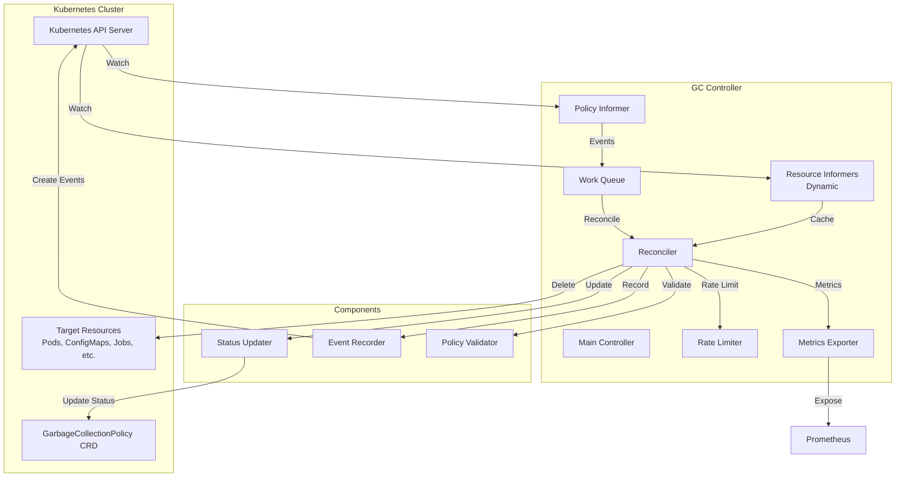

## Component Details

### 1. Main Controller (`cmd/gc-controller/main.go`)

The entry point that:
- Initializes Kubernetes clients (dynamic, core)
- Sets up leader election for HA
- Creates and starts the GC controller
- Configures metrics server
- Handles graceful shutdown

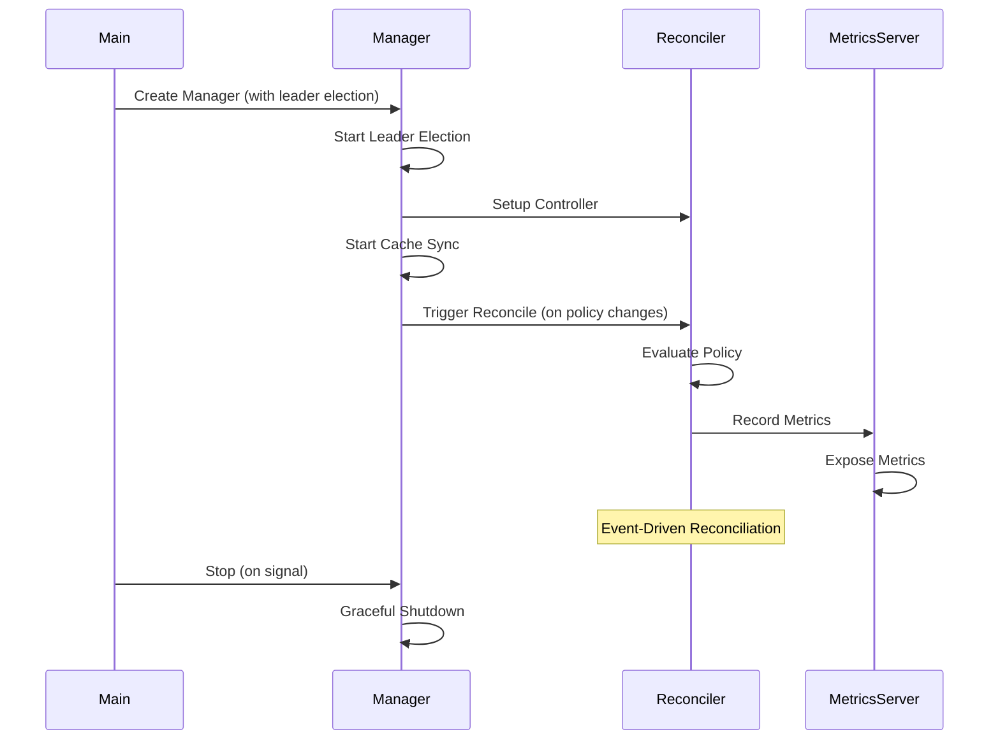

### 2. GC Policy Reconciler (`pkg/controller/reconciler.go`)

Core reconciliation logic using controller-runtime:

**Responsibilities:**
- Reconcile `GarbageCollectionPolicy` resources (event-driven)
- Create dynamic informers for target resources
- Evaluate policies against resources
- Delete resources that match TTL/conditions
- Update policy status
- Emit metrics and events

**Key Methods:**
- `NewGCPolicyReconciler()`: Initialize reconciler with clients
- `Reconcile()`: Main reconciliation function (triggered by policy changes)
- `evaluatePolicy()`: Evaluate single policy
- `deleteResource()`: Delete resource with rate limiting
- `SetupWithManager()`: Register reconciler with controller-runtime Manager

**Architecture:**
- Event-driven: Reconcile is triggered by policy changes (create, update, delete)
- Automatic requeue: Policies are requeued based on evaluation interval
- Built-in leader election: Only the leader processes policies
- Automatic cache sync: Manager handles cache synchronization

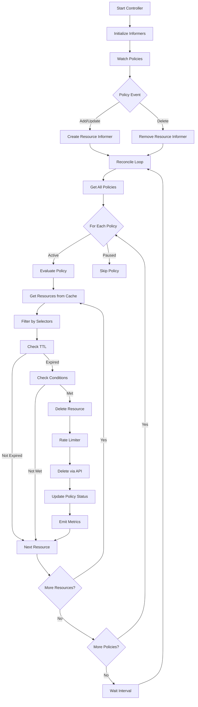

### 3. Policy Evaluation Flow

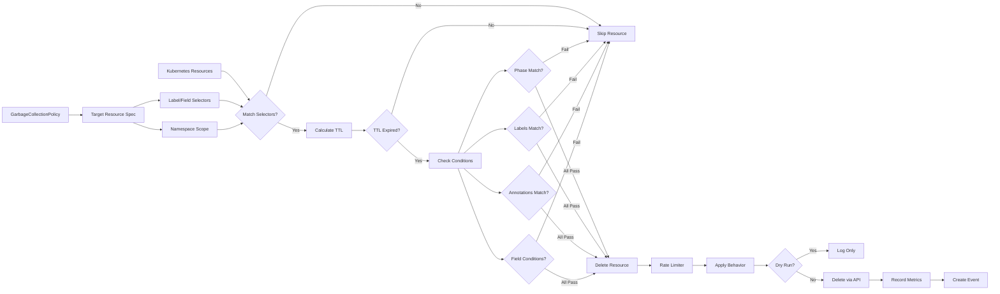

### 4. Informer Architecture

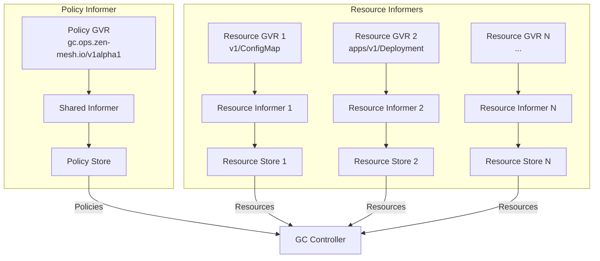

### 5. Rate Limiting

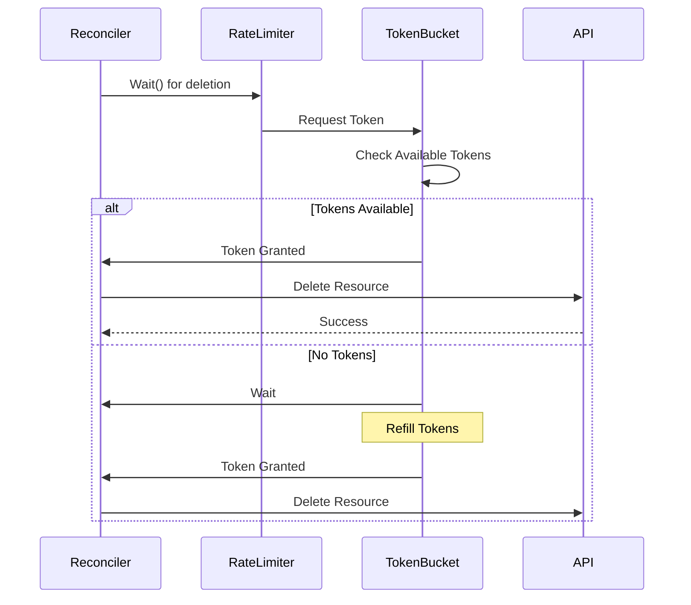

### 6. Metrics Flow

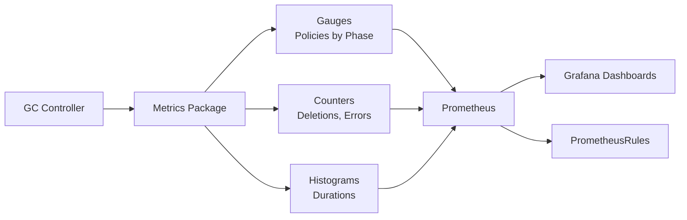

## Component Interaction Diagrams

### Controller Lifecycle

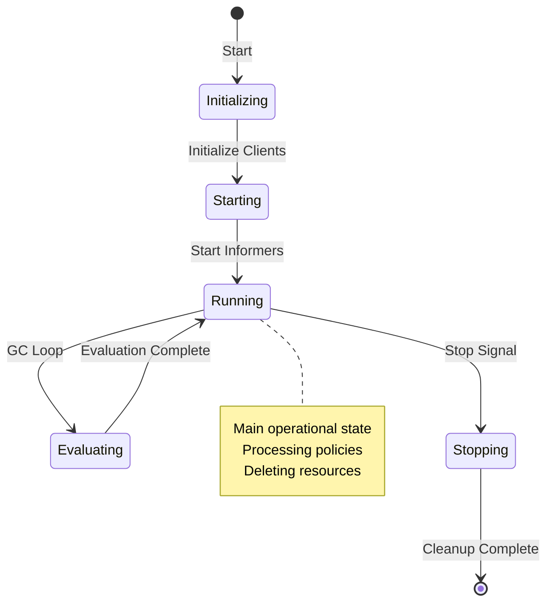

### Policy Lifecycle

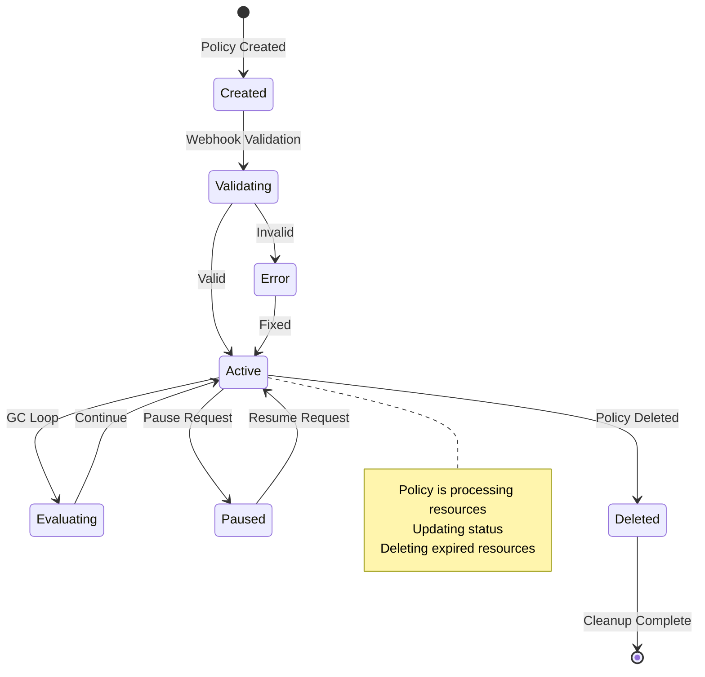

### Resource Deletion Flow

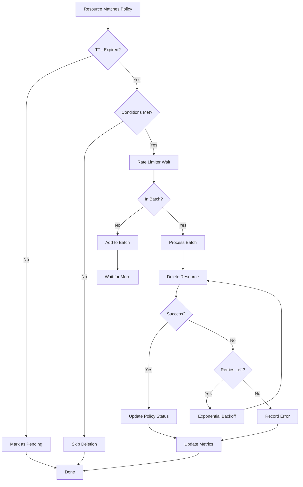

## Data Flow

### Policy Creation Flow

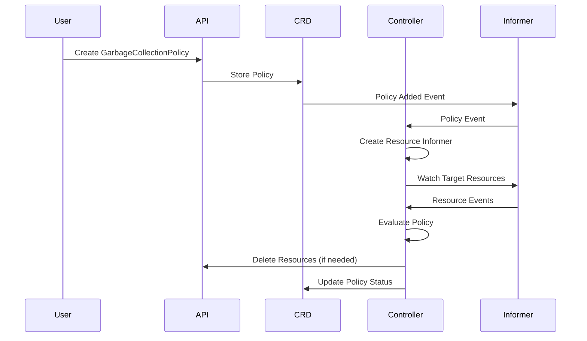

### Resource Deletion Flow

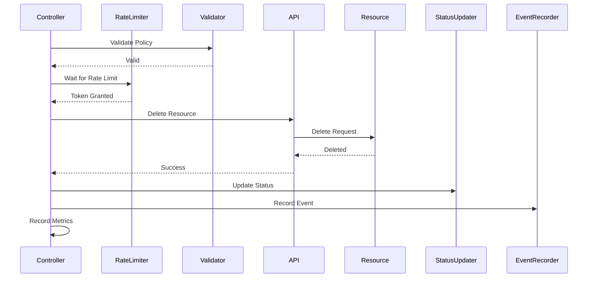

## High Availability

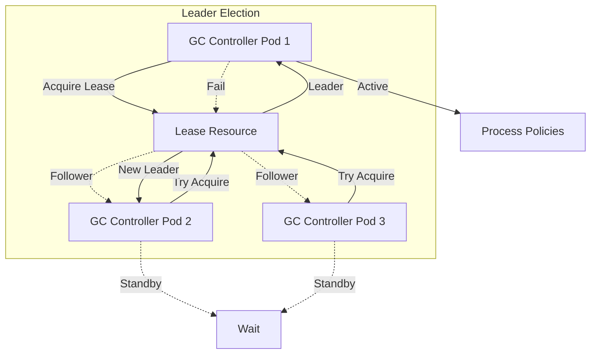

## Security Model

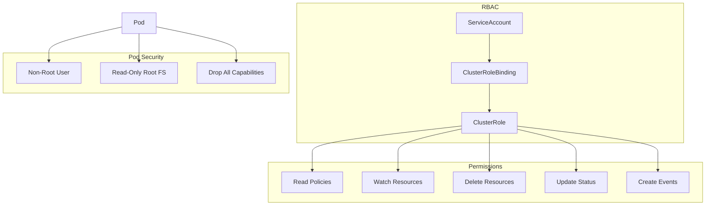

## Deployment Architecture

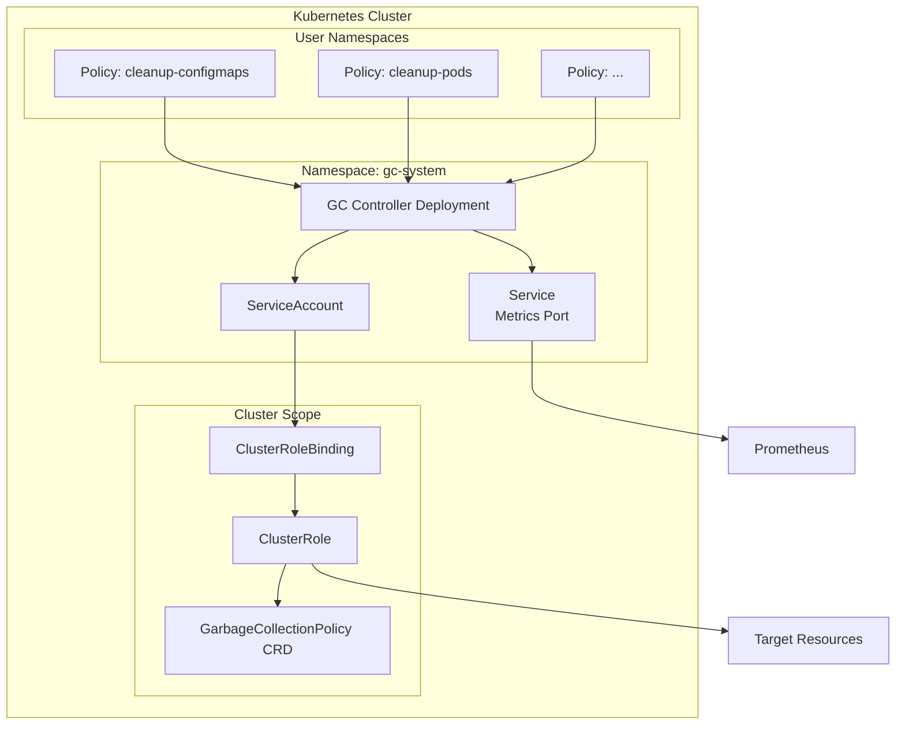

## Performance Considerations

### Informer Caching

- **Policy Informer**: Single informer for all policies (cluster-wide or namespace-scoped)
- **Resource Informers**: One informer per unique GVR (GroupVersionResource)
- **Cache Efficiency**: Resources cached in memory, reducing API server load
- **Resync Period**: Configurable resync interval (default: 1 minute)

### Selector Performance

**Label Selectors vs Field Selectors:**

- **Label Selectors** (`labelSelector`): 
  - ✅ Pushed down to the Kubernetes API server
  - ✅ Reduces network traffic and API server load
  - ✅ Only matching resources are fetched and cached
  - ✅ Recommended for best performance

- **Field Selectors** (`fieldSelector`):
  - ⚠️ Evaluated in-memory only (not pushed to API server)
  - ⚠️ All resources matching GVR/namespace/labelSelector are fetched first
  - ⚠️ Filtering happens in controller memory after fetch
  - ⚠️ Does not reduce API server load or network traffic
  - ⚠️ Can increase memory usage for large resource sets

**Best Practice:** Prefer `labelSelector` when possible. Use `fieldSelector` only when label-based filtering is not feasible.

### Rate Limiting

- **Token Bucket Algorithm**: Smooth rate limiting with burst support
- **Per-Policy Rate**: Each policy can specify `maxDeletionsPerSecond`
- **Default Rate**: 10 deletions/second (configurable)
- **Batching**: Optional batch size for efficient deletions

### Scalability

- **Horizontal Scaling**: Multiple controller replicas with leader election
- **Resource Limits**: Configurable CPU/memory limits
- **Worker Threads**: Configurable number of worker goroutines
- **Queue Depth**: Work queue prevents memory bloat

## Error Handling

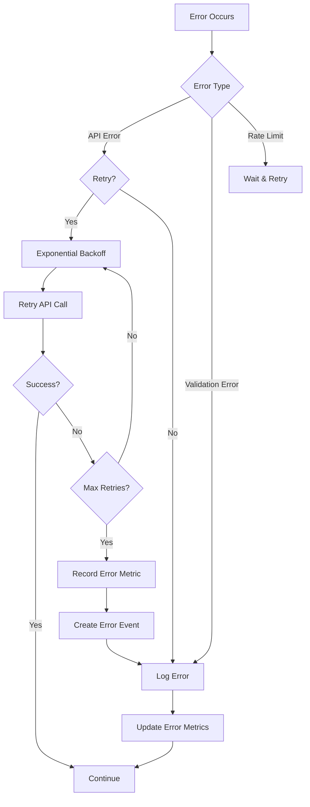

## Monitoring & Observability

### Metrics

- **Policy Metrics**: Number of policies by phase
- **Resource Metrics**: Matched, deleted, pending resources
- **Performance Metrics**: Evaluation duration, deletion duration
- **Error Metrics**: Error counts by type

### Events

- **Policy Events**: Policy evaluation started/completed/failed
- **Resource Events**: Resource deleted with reason
- **Error Events**: Deletion failures, status update failures

### Logging

- **Structured Logging**: Using klog with structured fields
- **Log Levels**: Configurable verbosity (V levels)
- **Context**: Policy name, resource name, namespace in logs

## Extension Points

### Custom TTL Calculations

The controller supports multiple TTL calculation methods:
- Fixed TTL (`secondsAfterCreation`)
- Field-based TTL (`fieldPath`)
- Relative TTL (`relativeTo`)
- Mapped TTL (`mappings`)

### Custom Conditions

Policies can specify complex conditions:
- Phase matching
- Label matching
- Annotation matching
- Field conditions (equals, not equals, in, not in, etc.)

### Behavior Customization

Each policy can customize deletion behavior:
- Rate limiting (`maxDeletionsPerSecond`)
- Batch size (`batchSize`)
- Dry run mode (`dryRun`)
- Grace period (`gracePeriodSeconds`)
- Propagation policy (`propagationPolicy`)

## Production Readiness

### Overall Assessment: **8.5/10** ✅

zen-gc is **production-ready** with excellent metrics, comprehensive documentation, good alerting, and solid test coverage.

| Category | Score | Status |
|----------|-------|--------|
| **Metrics** | 9/10 | ✅ Excellent |
| **Tests** | 8/10 | ✅ Good (65% overall coverage, 80%+ stretch goal) |
| **Documentation** | 10/10 | ✅ Excellent |
| **Alert Rules** | 8/10 | ✅ Good |
| **Dashboards** | 8/10 | ✅ Good |
| **Health Checks** | 7/10 | ⚠️ Good |
| **Security** | 9/10 | ✅ Excellent |
| **Observability** | 9/10 | ✅ Excellent |

### Metrics

**11 Comprehensive Metrics**:
- `gc_policies_total` - Policies by phase (gauge)
- `gc_resources_matched_total` - Resources matched (counter)
- `gc_resources_deleted_total` - Resources deleted (counter)
- `gc_deletion_duration_seconds` - Deletion latency (histogram)
- `gc_errors_total` - Errors by type (counter)
- `gc_evaluation_duration_seconds` - Evaluation latency (histogram)
- `gc_informers_total` - Active informers (gauge)
- `gc_rate_limiters_total` - Active rate limiters (gauge)
- `gc_resources_pending_total` - Pending deletions (gauge)
- `gc_leader_election_status` - Leader status (gauge)
- `gc_leader_election_transitions_total` - Transitions (counter)

See [METRICS.md](METRICS.md) for complete documentation.

### Test Coverage

**Current Coverage**: **65.4%** overall ✅ (meets 65% minimum via `make coverage`; see [TESTING.md](TESTING.md))

| Package | Coverage | Status |
|---------|----------|--------|
| `pkg/config` | 95.0% | ✅ Excellent |
| `pkg/errors` | 100.0% | ✅ Perfect |
| `pkg/validation` | 87.6% | ✅ Excellent |
| `pkg/webhook` | 80.3% | ✅ Good |
| `internal/config` | 93.9% | ✅ Excellent |
| `pkg/controller` | 51.4% | ⚠️ Low unit % (see below) |

**Coverage Requirements**:
- **Minimum**: 65% overall (`make coverage`; **enforced in CI** on every PR)
- **Stretch goal**: >80% overall; >85% on critical packages
- **`pkg/controller`**: Unit coverage is intentionally lower (~51%); critical paths are covered by [integration tests](TESTING.md#integration-tests) and **E2E/kind** (`make e2e-kind`). Do not treat controller unit % alone as a merge blocker—see [TESTING.md — pkg/controller unit coverage](TESTING.md#pkgcontroller-unit-coverage).

### Security

- ✅ Non-root container execution
- ✅ Read-only root filesystem
- ✅ Dropped capabilities
- ✅ RBAC with least-privilege principles
- ✅ Image security scanning
- ✅ Secret management best practices

See [SECURITY.md](../SECURITY.md) and [SECRET_MANAGEMENT.md](SECRET_MANAGEMENT.md) for details.

### Known Limitations

1. **Per-Policy Informers**: Each policy creates its own informer, which can scale to ~50-100 policies. For larger deployments, consider shared informer architecture (see [ROADMAP.md](../ROADMAP.md)).

2. **GVR Resolution**: Uses pluralization fallback when RESTMapper is unavailable. Most resources work correctly, but irregular CRDs may require explicit resource names.

### Recommendations

✅ **No immediate action required** - Component is production-ready.

**Future Enhancements** (optional):
- Raise `pkg/controller` coverage toward 65%+ per package and 80%+ overall
- Enhanced health checks with informer sync verification
- Shared informer architecture for >100 policies

